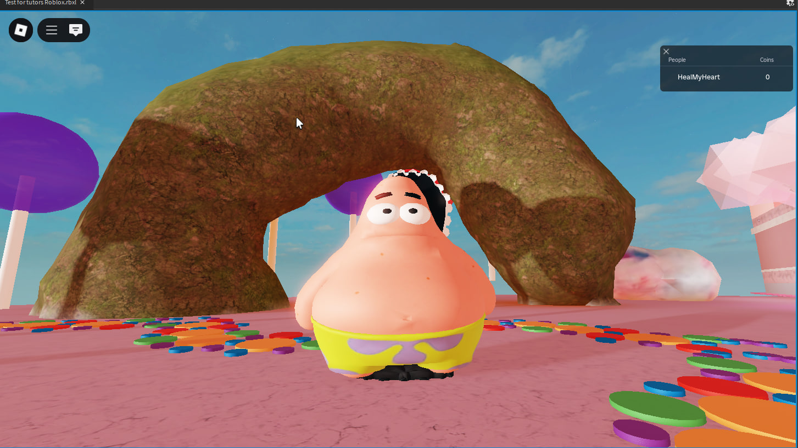

# Avaliação

### Construções:

- Construção de um arco com lama
- Construção de um arco com parts
- Criação de uma caixa de ferramentas feita de madeira.
- Criação de uma saliência, sem montanhas altas ou buracos profundos

### Fotos:

| Arco com Lama |                       Arco com Parts |
|---------|--------|
|  |  |

| Caixa de ferramentas |  Saliência |
|---------|--------|
|  |  |

---

## Vídeo

---

